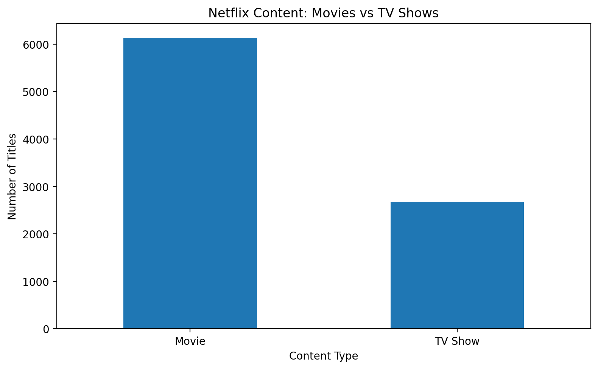
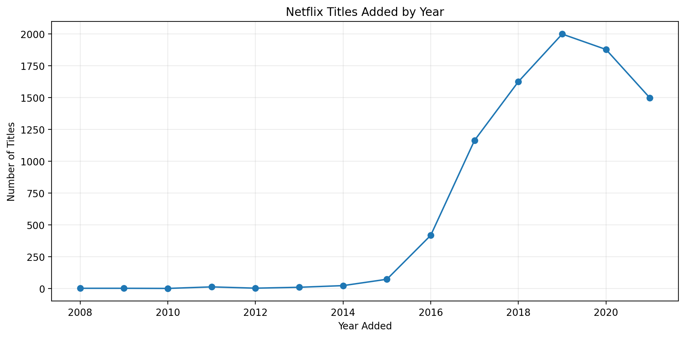
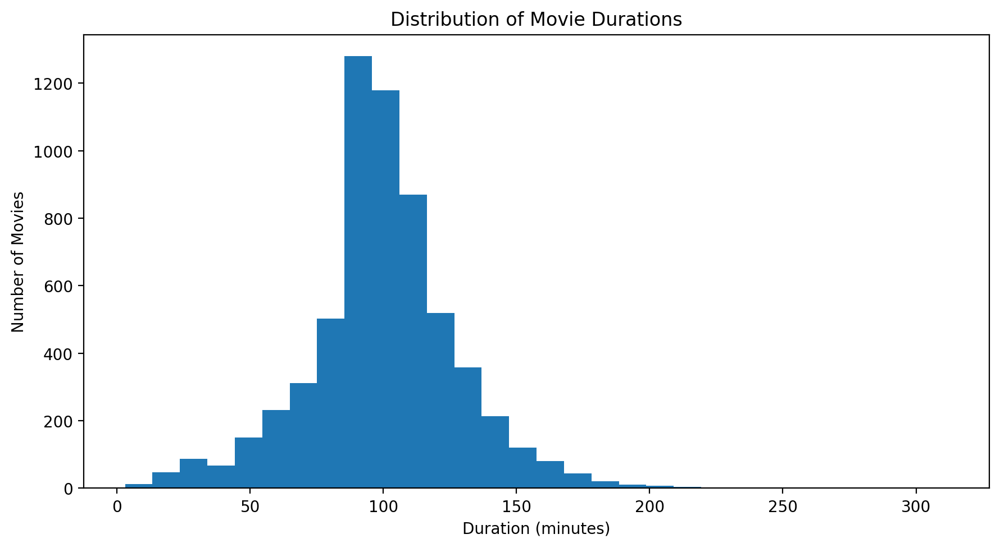
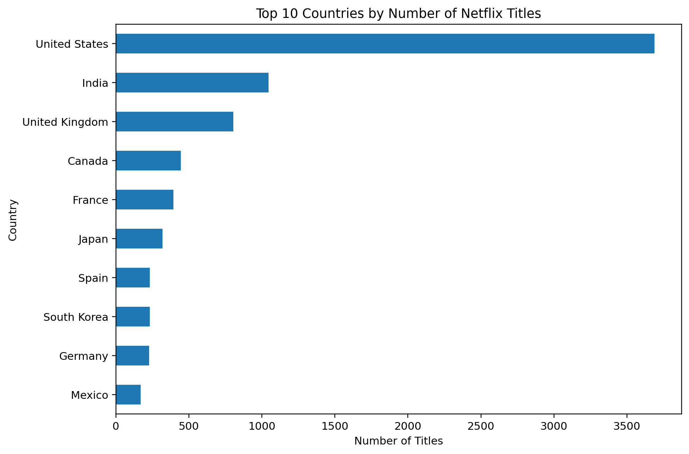
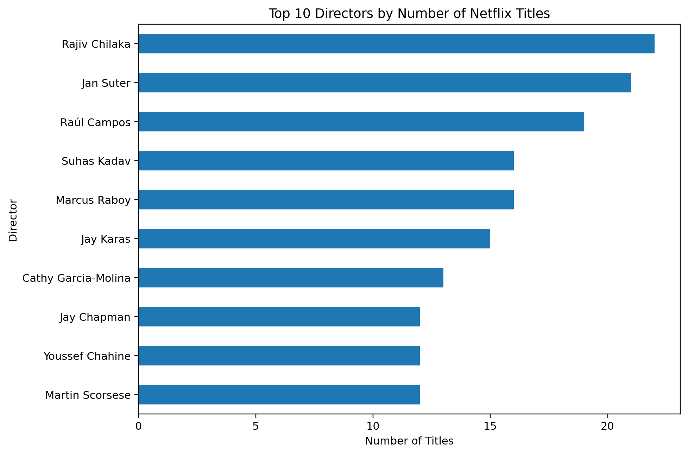
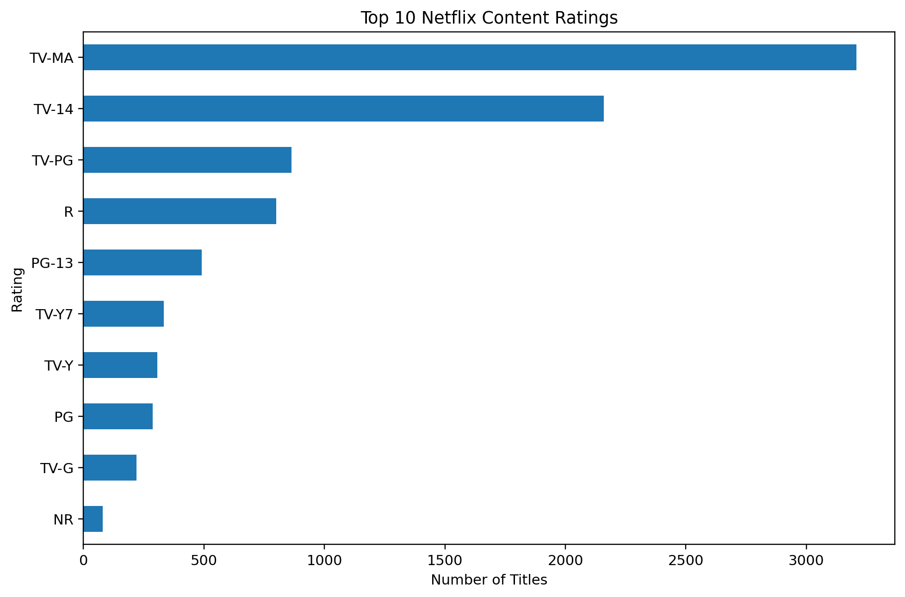

# Netflix Data Analysis

## 📌 Project Overview

This project performs **Exploratory Data Analysis (EDA)** on a Netflix titles dataset containing **8,807 movies and TV shows**.

The analysis focuses on understanding Netflix's content library through data cleaning, transformation, aggregation, statistical analysis, and visualization using Python.

## 🎯 Objectives

* Understand the structure and characteristics of the Netflix dataset
* Handle missing and inconsistent values
* Transform and prepare data for analysis
* Compare Movies and TV Shows
* Analyze content distribution by country, rating, and year
* Study movie duration and identify outliers
* Perform statistical and correlation analysis
* Create visualizations to identify useful patterns and trends

## 📊 Dataset

The original dataset contains **8,807 records and 12 columns**:

* `show_id`
* `type`
* `title`
* `director`
* `cast`
* `country`
* `date_added`
* `release_year`
* `rating`
* `duration`
* `listed_in`
* `description`

The dataset includes both **Movies and TV Shows**.

## 🛠️ Technologies Used

* **Python**
* **Pandas** – Data manipulation and analysis
* **NumPy** – Numerical operations
* **Matplotlib** – Data visualization
* **Seaborn** – Statistical visualization
* **SciPy** – Statistical analysis
* **Scikit-learn** – Machine learning utilities and evaluation metrics
* **Regex** – Text and duration processing

## 🔍 Data Cleaning & Transformation

The project includes:

* Handling missing values in columns such as director, cast, country, rating, duration, and date added
* Converting `date_added` into a datetime format
* Extracting year and month from the date
* Creating `year_added` and `month_added` features
* Extracting numeric movie duration using regular expressions
* Converting duration into a numerical format
* Cleaning special characters from titles
* Downcasting numerical columns to improve memory usage

## 📈 Analysis Performed

### Content Analysis

The dataset contains:

* **6,131 Movies**
* **2,676 TV Shows**

Movies make up the larger portion of the Netflix content in this dataset.

### Country Analysis

The analysis compares Netflix content across different countries and content types.

The United States has the highest number of titles in the dataset, followed by India and the United Kingdom.

### Year-wise Analysis

The number of titles added to Netflix was analyzed by year.

The highest number of titles were added in **2019**, with **2,016 titles**, followed by 2020 and 2021.

### Movie Duration Analysis

The project analyzes movie duration using descriptive statistics:

* Mean: **99.53 minutes**
* Median: **98 minutes**
* Mode: **90 minutes**
* Standard deviation: **28.37 minutes**
* Variance: **804.82**

The longest movie in the dataset has a duration of **312 minutes**.

### Director Analysis

The project also identifies the most prolific directors based on the number of titles associated with them.

### Statistical Analysis

The notebook includes:

* Mean, median, and mode
* Variance and standard deviation
* Skewness and kurtosis
* Correlation analysis
* IQR-based outlier detection

The analysis identified **453 movie-duration outliers**, representing approximately **7.4%** of the movies.

## 📊 Visualizations

The project uses **Matplotlib and Seaborn** to visualize patterns in the dataset.

Examples include:

* Netflix content type distribution
* Movie and TV Show comparisons
* Duration analysis
* Content trends
* Statistical distributions
* Other exploratory visualizations

## 📊 Visualizations

### Movies vs TV Shows


### Netflix Titles Added by Year


### Movie Duration Distribution


### Top 10 Countries by Number of Titles


### Top 10 Directors by Number of Titles


### Top 10 Netflix Content Ratings


## 📁 Project Structure

```text
Netflix-Data-Analysis/
│
├── Netflix_Data_Analysis.ipynb
├── netflix_titles.csv
├── README.md
│
├── netflix_content_type.png
├── netflix_titles_by_year.png
├── netflix_movie_duration.png
├── netflix_top_countries.png
├── netflix_top_directors.png
└── netflix_top_ratings.png
```

## 🚀 How to Run

1. Clone or download this repository.
2. Make sure `Netflix_Data_Analysis.ipynb` and `netflix_titles.csv` are in the same folder.
3. Open the notebook using **Jupyter Notebook**, **JupyterLab**, or **Google Colab**.
4. Run the cells from top to bottom.

The notebook loads the dataset using:

```python
df = pd.read_csv("netflix_titles.csv")
```

## 💡 Key Takeaways

* Netflix's catalog contains significantly more **Movies than TV Shows** in this dataset.
* The **United States** has the largest number of titles.
* **2019** had the highest number of titles added to the dataset.
* Movie duration is centered around approximately **100 minutes**.
* Statistical analysis and visualizations help identify distributions, relationships, and unusual values within the dataset.

## 👩‍💻 Author

**Nyasa Desai**

Computer Science Student
SCET, Surat

---

⭐ If you found this project useful, feel free to star the repository!
